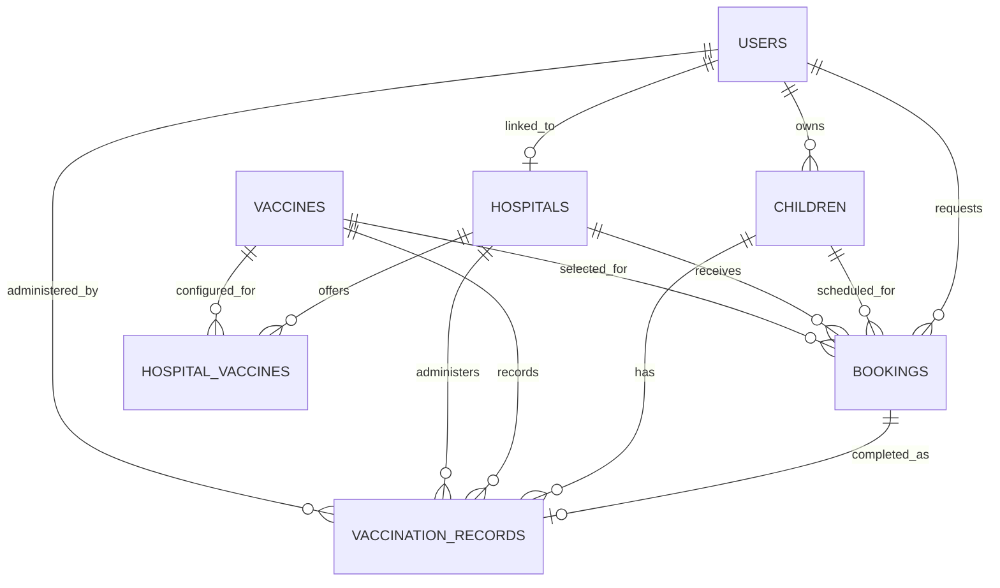

# Entity relationship diagram

```mermaid
erDiagram
  USERS ||--o{ CHILDREN : owns
  USERS ||--o| HOSPITALS : linked_to
  USERS ||--o{ BOOKINGS : requests
  CHILDREN ||--o{ BOOKINGS : scheduled_for
  HOSPITALS ||--o{ BOOKINGS : receives
  VACCINES ||--o{ BOOKINGS : selected_for
  HOSPITALS ||--o{ HOSPITAL_VACCINES : offers
  VACCINES ||--o{ HOSPITAL_VACCINES : configured_for
  BOOKINGS ||--o| VACCINATION_RECORDS : completed_as
  CHILDREN ||--o{ VACCINATION_RECORDS : has
  VACCINES ||--o{ VACCINATION_RECORDS : records
  HOSPITALS ||--o{ VACCINATION_RECORDS : administers
  USERS ||--o{ VACCINATION_RECORDS : administered_by
```

The SQL schema is the authoritative version of the relationships and constraints.
